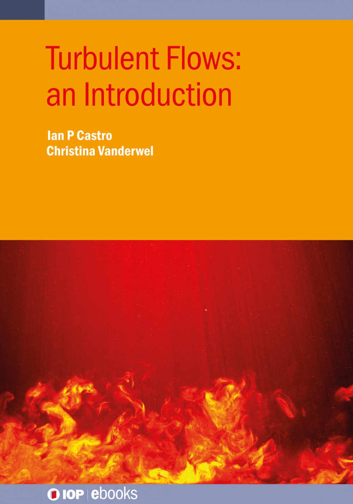

# Turbulence

This repository contains the Data and Code supporting the end-of-chapter exercises for the eBook:

> Ian Castro and Christina Vanderwel, 
[_Turbulent Flows: An Introduction,_](https://www.iop.org/) IOP, 2021.

The examples are  also used in the module <b>SESA6061 Turbulence</b> at the University of Southampton will be regularly updated and improved. 

Students are encouraged to try to solve the data analysis exercises on their own, before looking at the worked solutions; however, documented MATLAB codes are provided illustrating the solutions to each exercise. 

We hope to also provide solutions in other programming languagues such as Python in the near future. If you would like to contribute or suggest improvement, please contact the author at c.m.vanderwel@soton.ac.uk. 

All code is shared under the MIT license and you can share and adapt it freely. 

Last updated: 29 July 2021

## Sample Exercises

| Sample Exercises |	Data	| Codes	| Worked Solutions | 
| :----------------| :---: | :----: | :------------: |
| [Ch 1. Overall Introduction](questions/Ch1Exercises.pdf)	| Ex1.1: [WindtunnelSample1.txt](data/WindtunnelSample1.txt)	| [Ex1_1Solution.m](code/Ex1_1Solution.m)	| Coming soon… | 
| Ch 2. The governing equations	| No Data Files	| No Code required	| Coming soon… | 
| Ch 3. The scales of motion	| No Data Files	| No Code required	| Coming soon… | 
| Ch 4. Statistical functions and tools	| Ex4.3: WindtunnelSample1.txt   Ex4.4: WindtunnelSample2.txt	| Ex4_3Solution.m   Ex4_4Solution.m   Ex4_6PdfCode.m   Ex4_7SpectraCode.m	| Coming soon… | 
| 5. Canonical turbulent flows	| Ex5.1: HITData.txt   Ex5.2: HSFData.txt | 	Ex5_1Solution.m   Ex5_2Solution.m	| Coming soon… | 
| 6. Free turbulent shear flows	| Ex6.1: MixingLayerData.txt   Ex6.2: WakeData.txt 	| Ex6_1Solution.m   Ex6_2Solution.m	| Coming soon… | 
| 7. Internal wall-bounded flows	| Ex7.4: ChannelData.txt   Ex7.5: PipeData.txt 	| Ex7_4Solution.m   Ex7_5Solution.m	| Coming soon… | 
| 8. Internal wall-bounded flows	| Ex8.1-8.2: TBLData.txt   Ex8.3: RoughnessData.txt | 	Ex8_1Solution.m   Ex8_2Solution.m   Ex8_3Solution.m	| Coming soon… | 
| 9. Turbulent mixing |	Ex9.4: PlumeData1.txt   and PlumeData2.txt	| Ex9_4Solution.m	| Coming soon… | 

All the question sets, data files, code, and worked solutions can also be found in the repository directories [questions](questions), [data](data), [code](code), and [solutions](solutions).

## License
The code in this repository is provided under [MIT LICENSE](LICENSE) which means you are free to use, copy, and modify the content to help you learn about turbulent flows.
 
 For questions please contact
 [Christina Vanderwel](https://www.southampton.ac.uk/engineering/about/staff/cmv1n13.page).
